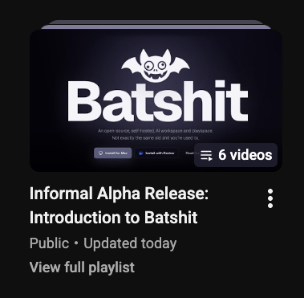

# Batshit

Batshit is an alpha self-hosted AI workspace for n8n orchestration, direct API agents, CLI-powered agents, tools, artifacts, voice, local runtimes, and project-aware work.

Batshit is open source under **AGPL-3.0-only**. See [LICENSE](LICENSE) for code terms and [TRADEMARKS.md](TRADEMARKS.md) for Batshit brand-use rules.

User-created chats, agents, prompts, workflows, artifacts, uploaded files, project files, generated content, and local data remain the user's content. Batshit integrates with n8n, which is separately licensed by n8n.

For contribution and security reporting expectations, see [CONTRIBUTING.md](CONTRIBUTING.md) and [SECURITY.md](SECURITY.md).

## Watch First

New to Batshit? Start with the [intro playlist on YouTube](https://www.youtube.com/watch?v=hS3NfNPgW70&list=PLeodpgBXojRy4Ssreao79TIX7PylhiI1D), then keep the [Batshit YouTube channel](https://www.youtube.com/@batshit-ai/) handy for walkthroughs and alpha updates.

## Report Alpha Bugs

Please use the [GitHub bug report form](https://github.com/SirBadfish/batshit/issues/new?template=bug_report.yml). If Batshit opens, click the bug icon under the chat bar or go to Settings -> Admin -> Diagnostics, review the preview, then attach the diagnostics zip if you are comfortable sharing it.

Diagnostics are designed to exclude chats, prompts, uploads, project files, backups, saved API keys, tokens, cookies, raw Redis data, and n8n workflow contents. See [Bug reports and diagnostics](docs/user-docs/troubleshooting/bug-reports-and-diagnostics.md).

## Start Here

The current launch-facing docs source lives in [docs/user-docs](docs/user-docs/README.md). Batshit's hosted docs site at `docs.batshit.ai` is generated from that source by the maintainers.

For a first install, read:

1. [Choose Mac app or Docker](docs/user-docs/installation/choose-mac-app-or-docker.md)
2. [Install Mac app](docs/user-docs/installation/install-mac-app.md) or [Install Docker](docs/user-docs/installation/install-docker.md)
3. [First run](docs/user-docs/installation/first-run.md)
4. [API keys and models](docs/user-docs/providers/api-keys-and-models.md)
5. [Connect n8n](docs/user-docs/primary-agents/connect-n8n.md)
6. [Backup and restore](docs/user-docs/admin/backup-and-restore.md)

Mac app and Docker are peer setup paths. The Mac app is the normal Mac path for host-local runtimes and direct local tooling. Docker is the cross-platform Compose path with clearer package boundaries, explicit sidecars, and the host-operator path for sandbox/add-on control.

## Local Defaults

Launch-facing local defaults:

- Batshit app, Mac app browser companion: `http://127.0.0.1:5620`
- Batshit app, Docker host: `http://localhost:5620`
- Batshit app, source-checkout dev host: `http://localhost:5621`
- batshit-server, Mac/Docker host: `http://localhost:5600`
- batshit-server, source-checkout dev host: `http://localhost:5610`
- n8n: `http://localhost:5678`
- Docker internal app URL: `http://app:3000`

See [Ports And URLs](docs/user-docs/reference/ports-and-urls.md) for the full caller-relative URL map.

## Mac app release status

Public users should install the packaged Mac app release artifact from the current GitHub release. Source-checkout rebuild scripts are maintainer/development workflow, not the normal install path.

## Documentation Map

- [User Docs Index](docs/user-docs/index.md)
- [Primary agents](docs/user-docs/primary-agents/overview.md)
- [Subagents](docs/user-docs/subagents/overview.md)
- [n8n workflow templates](docs/user-docs/resources/n8n-workflow-templates.md)
- [Docker runtime and add-ons](docs/user-docs/installation/docker-runtime-and-add-ons.md)
- [Security and trust](docs/user-docs/security/overview.md)
- [Troubleshooting](docs/user-docs/troubleshooting/agents-and-tools.md)

## Alpha status

Batshit is in alpha. Expect bugs, sharp edges, and active iteration. The docs should say when something is required, optional, advanced, or not included; when they do not, treat that as a docs bug worth fixing.
